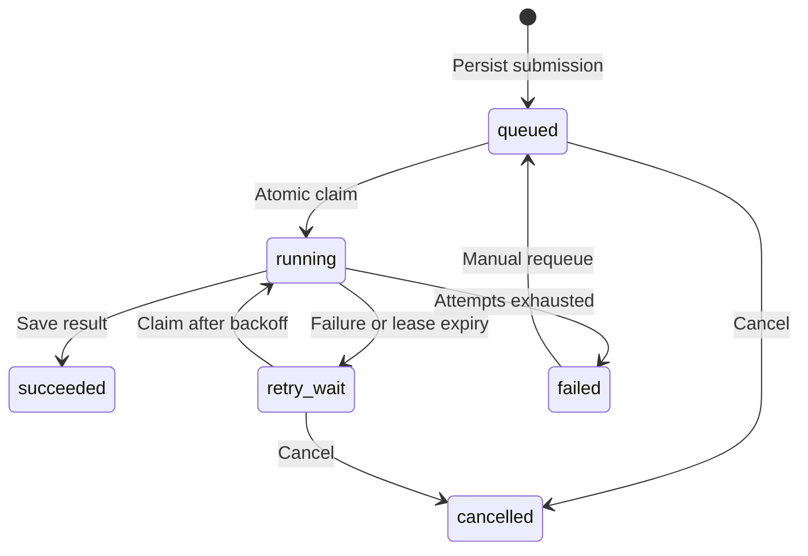

# QueuePilot

**Make background jobs, retries, and results easy to inspect.**

QueuePilot is a durable background job service built with **FastAPI + SQLite**. Submit a text summarization job, receive its ID immediately, and track its status, results, retries, and recovery events in a Chinese web console. Jobs and execution history persist on a single machine, with idempotent submission, atomic worker claims, and lease recovery.

The default **mock summarizer** produces deterministic summaries for offline runs. Switch to the optional **Ollama adapter** to generate summaries with a local language model.

**中文简介：** QueuePilot 是基于 FastAPI 与 SQLite 的持久化摘要任务服务，支持幂等提交、自动重试和租约恢复，通过中文控制台查看任务状态、结果与执行历史；默认使用离线 mock 摘要器，可选接入本地 Ollama。

[English](README.md) · [完整中文文档](README_ZH.md)


## What you can explore

- **A complete job lifecycle:** submit → queue → execute → inspect the summary and every execution event.
- **Automatic retries:** simulate transient failures and inspect exponential backoff and attempt exhaustion.
- **Idempotent submission:** the same `Idempotency-Key` and normalized request return the original job; a changed request with the same key is rejected.
- **Recovery:** jobs and events survive restarts; expired leases are recovered, and stale workers cannot overwrite a newer execution.
- **Control and visibility:** cancel waiting jobs, requeue failed jobs, filter and paginate the job list, inspect Prometheus metrics, and call the API through OpenAPI documentation.

## Quick start

Requires **Python 3.12+** and [uv](https://docs.astral.sh/uv/). Run these commands from the project root. Dependency versions are recorded in `uv.lock`.

On Windows PowerShell:

```powershell
.\start.ps1
```

The script installs locked dependencies and starts the API with an embedded worker. If your execution policy prevents running the script, use:

```powershell
uv sync --locked --dev
.\.venv\Scripts\python.exe -m queuepilot
```

On Linux or macOS, or to start directly with uv:

```bash
uv sync --locked --dev
uv run python -m queuepilot
```

Open the [job console](http://127.0.0.1:8765/), [API docs](http://127.0.0.1:8765/docs), or [health check](http://127.0.0.1:8765/healthz). The default service listens on `127.0.0.1:8765`, with no configuration file or authentication required. Restarting retains jobs in `data/queuepilot.db`.

### A one-minute walkthrough

1. Click **成功示例** (success example) to see a summary and `submitted → started → succeeded` events.
2. Click **自动重试** (automatic retry). Two simulated failures are followed by success on the third attempt; the default waits are 2 and 4 seconds.
3. Click **失败示例** (failure example). All three attempts fail, and **重新排队** (requeue) becomes available. Requeuing preserves history and resets the current attempt counter. This example retains its simulated failure setting, so it fails again if requeued.
4. Submit your own text, expand **幂等设置** (idempotency settings), and enter a key. Submit the unchanged request again to retrieve the original job.
5. Filter by status and select a job to inspect its details. The console refreshes every 2 seconds, pauses polling while the page is hidden, and also supports manual refresh.

Cancellation is available only for `queued` and `retry_wait` jobs. Manual requeue is available only for `failed` jobs.

## Configuration

The application reads environment variables and **does not automatically load `.env`**. The Windows script reads a project-local `.env`, accepts only `QUEUEPILOT_` assignments, treats values as literal text, and gives existing process variables precedence.

```powershell
Copy-Item .env.example .env
# Edit .env as needed, then start the service.
.\start.ps1
```

To load an existing `.env` directly with uv:

```bash
uv run --env-file .env python -m queuepilot
```

| Variable | Default | Purpose |
| --- | --- | --- |
| `QUEUEPILOT_DB` | `data/queuepilot.db` | SQLite database path |
| `QUEUEPILOT_PROVIDER` | `mock` | `mock` or `ollama` |
| `QUEUEPILOT_API_KEY` | Empty | Optional shared API key |
| `QUEUEPILOT_WORKER_ENABLED` | `true` | Start a worker inside the API process |
| `QUEUEPILOT_POLL_SECONDS` | `0.5` | Worker polling interval; must be positive |
| `QUEUEPILOT_LEASE_SECONDS` | `60` | Claim lease duration; must exceed 30 seconds |
| `QUEUEPILOT_RETRY_BASE` | `2` | Initial retry delay in seconds; must be positive; subsequent delays double, capped at 60 seconds |
| `QUEUEPILOT_OLLAMA_URL` | `http://127.0.0.1:11434` | Server-configured model endpoint |
| `QUEUEPILOT_OLLAMA_MODEL` | `qwen3:4b` | Ollama model name |
| `QUEUEPILOT_HOST` | `127.0.0.1` | API bind address |
| `QUEUEPILOT_PORT` | `8765` | API port |

When `QUEUEPILOT_API_KEY` is set, all `/api/*` and `/metrics` requests require `X-API-Key`. Enter the key in the console and click **连接** (connect). The frontend holds it only in the current page's memory and does not write it to browser storage. Static pages, `/healthz`, and documentation remain accessible; business API calls from the docs still require the key. This is a shared-key scheme without user, tenant, or role separation. Real secrets and personal job data belong outside version control; `.env`, databases, and logs are ignored.

### A separate worker process

Set `QUEUEPILOT_WORKER_ENABLED=false` for the API, then start a worker in another terminal. Both processes must use the same database path and execution settings.

```powershell
# Terminal 1: .env contains QUEUEPILOT_WORKER_ENABLED=false.
.\start.ps1

# Terminal 2: run from the same project root and load the same .env.
.\start.ps1 -Worker
```

The direct worker command is `python -m queuepilot worker`. To load `.env` with uv:

```bash
uv run --env-file .env python -m queuepilot worker
```

`QUEUEPILOT_WORKER_ENABLED` controls only the API's embedded worker; it does not disable a separate worker process. Atomic claims allow multiple worker processes to share the database on one machine. QueuePilot does not provide cross-machine coordination.

### Optional Ollama

Install and start [Ollama](https://github.com/ollama/ollama), then prepare the model named in your configuration. For the default model:

```bash
ollama pull qwen3:4b
```

Set `QUEUEPILOT_PROVIDER=ollama` and restart QueuePilot. The adapter sends a non-streaming request to the configured `/api/generate` endpoint with a fixed 30-second timeout, so the lease must exceed 30 seconds. The endpoint and model come from server configuration; a submitted job cannot choose an endpoint.

Ollama mode does not support simulated failures, and the console disables those inputs and demo buttons. Unavailable services, timeouts, and invalid responses produce predefined error codes and follow the job's retry policy. Adapter protocol behavior is tested with simulated HTTP responses; a real Ollama model run requires your local model service and has not been verified in the current validation scope.

### Docker

```bash
docker compose up --build
```

The supplied image uses Python 3.12 and a non-root user. The container binds to `0.0.0.0:8765`; Compose publishes it only on the host's `127.0.0.1:8765`. Jobs are stored in the `queuepilot-data` named volume. Compose runs with default settings without `.env` and uses values from an existing `.env` for configurable settings; its database path, bind address, and port are fixed for the container.

To reach Ollama on the host, set `QUEUEPILOT_OLLAMA_URL=http://host.docker.internal:11434`. If you copied `.env.example`, replace its loopback address with this value: `127.0.0.1` inside the container refers to the container itself. When the variable is unset, Compose already defaults to `host.docker.internal`.

`docker compose down` stops the service while preserving its named volume. Keep the volume if you need the job history. The Docker build and container runtime have not been verified in the current validation scope.

## API example

Submit a job that fails twice and succeeds on its third attempt from PowerShell:

```powershell
$body = @{
    text = 'The API returns a job ID immediately. The worker retries temporary failures and stores results and events.'
    max_attempts = 3
    simulate_failures = 2
} | ConvertTo-Json
$headers = @{ 'Idempotency-Key' = 'demo-001' }
$job = Invoke-RestMethod -Uri 'http://127.0.0.1:8765/api/jobs' `
    -Method Post -ContentType 'application/json; charset=utf-8' -Headers $headers -Body $body
$job

Invoke-RestMethod "http://127.0.0.1:8765/api/jobs/$($job.id)"
Invoke-RestMethod "http://127.0.0.1:8765/api/jobs/$($job.id)/events?after=0"
```

If authentication is enabled, supply your `X-API-Key` header on every business API request. An idempotency key accepts 1–128 ASCII letters, digits, or `. _ : -`. Text is trimmed and must contain 1–20,000 characters; `max_attempts` is an integer from 1–5 and `simulate_failures` from 0–4, with nonzero simulation allowed only in mock mode.

| Endpoint | Behavior |
| --- | --- |
| `POST /api/jobs` | Returns the job; `202` for creation, `200` for an idempotent replay |
| `GET /api/jobs?status=succeeded&limit=20&offset=0` | Newest-first pagination with `items / total / limit / offset`; omit `status` to list all jobs |
| `GET /api/jobs/{id}` | Status, input, summary, error, attempt counters, and timestamps |
| `GET /api/jobs/{id}/events?after=0` | Returns `items` in ascending event ID order; use `after` for incremental reads |
| `POST /api/jobs/{id}/cancel` | Cancels a waiting job and returns it |
| `POST /api/jobs/{id}/retry` | Requeues a failed job and returns it |
| `GET /api/stats` | Status counts, total jobs, cumulative attempts, and provider/worker/polling settings |
| `GET /metrics` | Prometheus text metrics: `queuepilot_jobs` and `queuepilot_attempts_total` |
| `GET /healthz` | Returns `{"status":"ok"}` when the database is readable |

Timestamps are **Unix seconds**. Conflicting state transitions or idempotency requests return `409`; unknown jobs return `404`; invalid input returns `422`; failed authentication returns `401`; database unavailability returns `503`.

## How recovery works



SQLite `BEGIN IMMEDIATE` transactions make the idempotency check and job insertion indivisible, and prevent two workers from successfully claiming the same runnable job at the same time. Every claim receives a new `lease_token`. Saving a result or failure requires the current token, a `running` state, and an unexpired lease. State changes and events commit in one transaction; external model calls run outside database transactions.

Execution semantics are **at least once**. A worker can exit after an external call succeeds but before it saves the result, causing the call to repeat after recovery. Leases protect database state, but cannot make external side effects happen exactly once. Integrations that send messages, charge money, or write to another system need provider idempotency or another deduplication strategy.

## Project structure

```text
queuepilot/
├── api.py            # REST, auth, OpenAPI, console, and app lifecycle
├── config.py         # Environment settings and validation
├── store.py          # SQLite transactions, state, idempotency, and events
├── worker.py         # Claims, execution, backoff, and lease recovery
├── providers.py      # Deterministic mock and local Ollama adapter
├── __main__.py       # API and separate-worker entry points
└── static/           # Chinese console; no external CDN
tests/                # Behavioral tests with temporary databases and controlled clocks
examples/smoke.py     # HTTP checks against a running mock server
docs/preview.jpg      # Console screenshot
```

Start with submission and claim transactions in `store.py`, then follow success, failure, and recovery in `worker.py`, and finally inspect API validation and authentication. The console uses plain HTML/CSS/JavaScript and displays user input and model results with `textContent`.

## Tests and HTTP smoke check

```bash
uv sync --locked --dev
uv run ruff check .
uv run pytest -q
```

With the service running in mock mode, check the HTTP lifecycle in another terminal:

```bash
uv run python examples/smoke.py
```

The script submits three jobs and checks idempotent replay, request conflict, normal success, retry success, final failure, event history, and web assets. It reads `QUEUEPILOT_API_KEY` from its environment if authentication is enabled; use `uv run --env-file .env python examples/smoke.py` to load the same key from `.env`.

**Validation scope:** 40 tests passed, covering concurrent idempotency, atomic claims, retries and exhaustion, persistence, lease recovery, stale or expired result rejection, cancellation, manual requeue, pagination, authentication, input boundaries, and provider protocol errors. Mock HTTP lifecycle checks, lint, and JavaScript syntax checks also passed. The repository includes a GitHub Actions workflow for locked-dependency lint and tests. Real Ollama inference and Docker build/run remain unverified.

## Scope

QueuePilot is intended for learning, local demonstrations, and reading the mechanics of a durable queue. SQLite keeps the setup small; the project makes no high-throughput or production SLA claims. It has no registration, multi-tenancy, billing, webhooks, or multi-step agents. The default configuration serves a local demo; hosting it publicly requires deployment-specific access control, TLS, and resource limits.
