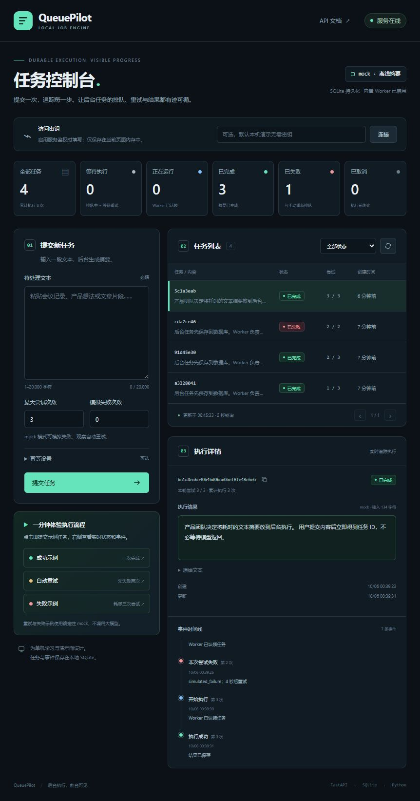
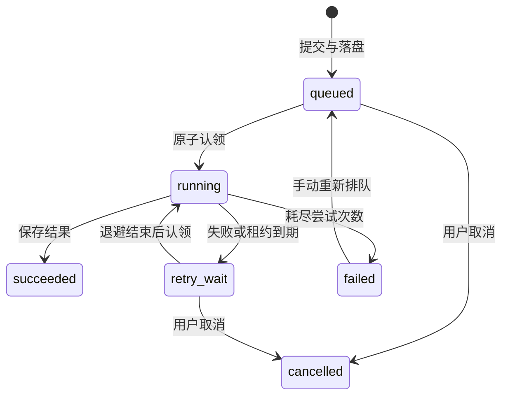

# QueuePilot

**让后台任务的排队、重试和结果都有迹可循。**

QueuePilot 是基于 **FastAPI + SQLite** 的持久化摘要任务服务。提交文本后立即获得任务 ID，通过中文控制台查看后台任务的状态、结果、重试与恢复事件。任务与执行历史保存在单机数据库中，支持幂等提交、原子认领和租约恢复。

默认使用 **mock 摘要器**，在离线环境中生成确定性摘要。选择 **Ollama 适配器**，即可接入本地语言模型生成摘要。

**English overview:** QueuePilot is a durable summarization job service built with FastAPI and SQLite. Its Chinese web console shows job status, results, retries, and recovery events, with idempotent submission, atomic worker claims, and lease recovery. The default mock summarizer runs offline; an Ollama adapter connects to a local language model.

[English](README.md) · [中文](README_ZH.md)



## 可以体验什么

- **任务闭环**：提交 → 排队 → 执行 → 查看摘要与完整事件时间线。
- **自动重试**：可模拟临时失败，观察指数退避与尝试次数耗尽。
- **幂等提交**：相同 `Idempotency-Key` 与相同规范化请求返回原任务；相同键对应不同请求时拒绝提交。
- **重启恢复**：任务和事件落盘；Worker 回收过期租约，迟到结果不能覆盖新执行。
- **操作与观察**：取消待执行任务、手动重新排队、按状态筛选与分页、Prometheus 指标和 OpenAPI 文档。

## 快速运行

需要 **Python 3.12 或更高版本**和 [uv](https://docs.astral.sh/uv/)。以下命令在项目根目录执行，依赖版本记录在 `uv.lock` 中。

Windows PowerShell：

```powershell
.\start.ps1
```

脚本安装锁定依赖，并启动 API 和内置 Worker。如果系统执行策略不允许脚本，可用手动命令：

```powershell
uv sync --locked --dev
.\.venv\Scripts\python.exe -m queuepilot
```

Linux、macOS 或直接使用 uv：

```bash
uv sync --locked --dev
uv run python -m queuepilot
```

打开 [任务控制台](http://127.0.0.1:8765/)、[API 文档](http://127.0.0.1:8765/docs) 或 [健康检查](http://127.0.0.1:8765/healthz)。默认只监听本机 `127.0.0.1:8765`，无需配置文件或鉴权。停止后再次启动会继续使用 `data/queuepilot.db`，保留已有任务。

### 一分钟演示

1. 点击「成功示例」，查看摘要和 `submitted → started → succeeded` 事件。
2. 点击「自动重试」，观察两次模拟失败后第三次成功；默认退避依次为 2 秒、4 秒。
3. 点击「失败示例」，三次尝试全部失败，出现「重新排队」按钮。重新排队保留历史、本轮计数归零；该示例仍保留模拟失败配置，因此再次执行也会失败。
4. 提交自己的文本，展开「幂等设置」填写键，然后保持请求内容不变再次提交，观察返回原任务。
5. 按状态筛选、选择任一任务查看详情。控制台每 2 秒更新，也可手动刷新；页面进入后台时暂停轮询。

取消仅适用于 `queued` 和 `retry_wait`；手动重新排队仅适用于 `failed`。

## 配置

程序通过环境变量读取配置，**不会自动加载 `.env`**。Windows 脚本读取项目目录的 `.env`，只接受 `QUEUEPILOT_` 配置，将值作为字面文本处理，并优先保留已有进程环境变量。

```powershell
Copy-Item .env.example .env
# 按需编辑 .env，然后启动。
.\start.ps1
```

使用 uv 直接加载已创建的 `.env`：

```bash
uv run --env-file .env python -m queuepilot
```

| 环境变量 | 默认值 | 含义 |
| --- | --- | --- |
| `QUEUEPILOT_DB` | `data/queuepilot.db` | SQLite 数据库路径 |
| `QUEUEPILOT_PROVIDER` | `mock` | `mock` 或 `ollama` |
| `QUEUEPILOT_API_KEY` | 空 | 可选共享 API 密钥 |
| `QUEUEPILOT_WORKER_ENABLED` | `true` | API 进程是否启动内置 Worker |
| `QUEUEPILOT_POLL_SECONDS` | `0.5` | Worker 轮询间隔，必须大于 0 |
| `QUEUEPILOT_LEASE_SECONDS` | `60` | 认领租约，必须大于 30 秒 |
| `QUEUEPILOT_RETRY_BASE` | `2` | 首次重试等待秒数，必须大于 0；后续翻倍，最大等待 60 秒 |
| `QUEUEPILOT_OLLAMA_URL` | `http://127.0.0.1:11434` | 服务端配置的模型地址 |
| `QUEUEPILOT_OLLAMA_MODEL` | `qwen3:4b` | Ollama 模型名 |
| `QUEUEPILOT_HOST` | `127.0.0.1` | API 监听地址 |
| `QUEUEPILOT_PORT` | `8765` | API 端口 |

启用 `QUEUEPILOT_API_KEY` 后，所有 `/api/*` 和 `/metrics` 请求都需要 `X-API-Key`。在控制台填写密钥并点击「连接」即可；前端仅将密钥保存在当前页面内存，不写入浏览器存储。静态页面、`/healthz` 和文档页面公开，文档中的业务调用仍需要密钥。这是共享密钥方案，不提供用户、租户或角色隔离。真实秘密和个人任务数据应留在版本控制之外；`.env`、数据库及日志均已忽略。

### 独立 Worker

设置 `QUEUEPILOT_WORKER_ENABLED=false` 后启动 API，再在另一终端启动 Worker。两个进程需使用同一数据库路径和相同的执行配置。

```powershell
# 终端一：.env 中已设置 QUEUEPILOT_WORKER_ENABLED=false。
.\start.ps1

# 终端二：同样在项目根目录，读取同一份 .env。
.\start.ps1 -Worker
```

直接命令为 `python -m queuepilot worker`。如需通过 uv 加载 `.env`：

```bash
uv run --env-file .env python -m queuepilot worker
```

`QUEUEPILOT_WORKER_ENABLED` 只控制 API 内置 Worker，不禁止独立 Worker 进程运行。原子认领允许同一台机器上的多个 Worker 共享数据库，本项目不提供跨机器协调。

### 可选 Ollama

先安装并启动 [Ollama](https://github.com/ollama/ollama)，准备配置中指定的模型。默认模型为：

```bash
ollama pull qwen3:4b
```

设置 `QUEUEPILOT_PROVIDER=ollama` 并重启 QueuePilot。适配器以非流式方式调用配置地址的 `/api/generate`，请求超时固定为 30 秒，所以租约必须大于 30 秒。模型地址和模型名来自服务端配置，任务请求不能指定目标地址。

Ollama 模式不支持模拟失败，控制台会禁用对应输入和示例按钮。模型不可用、超时或返回无效内容时，任务会记录预定义错误类别并按规则重试。适配器协议已通过模拟 HTTP 响应测试；真实模型运行需要准备本地 Ollama 服务，当前验证范围尚未包含真实模型推理。

### Docker

```bash
docker compose up --build
```

提供的镜像配置使用 Python 3.12 和非 root 用户。容器内监听 `0.0.0.0:8765`，Compose 仅将端口发布到宿主机 `127.0.0.1:8765`；数据库保存在命名卷 `queuepilot-data`。默认无需 `.env`，Compose 也会使用已存在 `.env` 中的可配置项；数据库路径、监听地址和端口固定为容器适用值。

Docker 中连接宿主机 Ollama 时，设置 `QUEUEPILOT_OLLAMA_URL=http://host.docker.internal:11434`。如果已复制 `.env.example`，需将其中的回环地址改为这个值；容器内的 `127.0.0.1` 指向容器自身。未设置该变量时，Compose 默认使用 `host.docker.internal`。

`docker compose down` 停止服务并保留命名卷；需要任务历史时应保留卷。当前验证范围尚未包含 Docker 实际构建与容器运行。

## API 示例

PowerShell 提交一个先失败两次、第三次成功的任务：

```powershell
$body = @{
    text = '任务提交后立即返回 ID，Worker 在后台执行。临时失败自动重试，结果与事件持久化。'
    max_attempts = 3
    simulate_failures = 2
} | ConvertTo-Json
$headers = @{ 'Idempotency-Key' = 'demo-001' }
$job = Invoke-RestMethod -Uri 'http://127.0.0.1:8765/api/jobs' `
    -Method Post -ContentType 'application/json; charset=utf-8' -Headers $headers -Body $body
$job

Invoke-RestMethod "http://127.0.0.1:8765/api/jobs/$($job.id)"
Invoke-RestMethod "http://127.0.0.1:8765/api/jobs/$($job.id)/events?after=0"
```

若配置鉴权，每个业务 API 请求都需额外提供自己的 `X-API-Key`。幂等键允许 1–128 个 ASCII 字母、数字或 `. _ : -`；文本去除首尾空白后长度为 1–20,000 个字符，`max_attempts` 为 1–5 的整数，`simulate_failures` 为 0–4 的整数，非零模拟失败仅适用于 mock。

| 接口 | 功能与响应 |
| --- | --- |
| `POST /api/jobs` | 返回任务；新任务 `202`，幂等重复 `200` |
| `GET /api/jobs?status=succeeded&limit=20&offset=0` | 按创建时间倒序分页，返回 `items / total / limit / offset`；不筛选时省略 `status` |
| `GET /api/jobs/{id}` | 任务状态、输入、摘要、错误、尝试次数与时间戳 |
| `GET /api/jobs/{id}/events?after=0` | 返回 `items`；事件 ID 升序，`after` 可用于增量查询 |
| `POST /api/jobs/{id}/cancel` | 取消待执行任务，返回任务 |
| `POST /api/jobs/{id}/retry` | 将已失败任务重新排队，返回任务 |
| `GET /api/stats` | 状态计数、任务总数、累计尝试及 provider、Worker、轮询配置 |
| `GET /metrics` | Prometheus 文本指标 `queuepilot_jobs`、`queuepilot_attempts_total` |
| `GET /healthz` | 数据库可读时返回 `{"status":"ok"}` |

时间戳为 **Unix 秒**。状态转换或幂等请求冲突返回 `409`，任务不存在返回 `404`，输入无效返回 `422`，鉴权失败返回 `401`，数据库暂时不可用返回 `503`。

## 为什么任务能恢复



SQLite 的 `BEGIN IMMEDIATE` 事务保证幂等检查与任务写入不可分割，也保证同一可运行任务不会被两个 Worker 同时成功认领。每次认领生成独立 `lease_token`；完成或失败时必须匹配当前 token、`running` 状态和未过期租约。状态与事件在同一事务中提交，外部模型请求在事务之外执行。

执行语义是**至少一次**：Worker 可能在外部调用成功、保存结果前退出，恢复后会再次调用。租约保护数据库结果，不能保证外部副作用恰好发生一次。接入发消息、扣费或写入第三方系统等副作用时，需要供应商幂等或其他去重策略。

## 项目结构

```text
queuepilot/
├── api.py            # REST、鉴权、OpenAPI、控制台与应用生命周期
├── config.py         # 环境配置与验证
├── store.py          # SQLite 事务、任务状态、幂等与事件
├── worker.py         # 认领、执行、退避与租约恢复
├── providers.py      # 确定性 mock / 本地 Ollama
├── __main__.py       # API 与独立 Worker 启动入口
└── static/           # 无外部 CDN 的中文控制台
tests/                # 临时数据库与可控时钟的行为测试
examples/smoke.py     # 针对运行中 mock 服务的 HTTP 检查
docs/preview.jpg      # 控制台截图
```

建议从 `store.py` 的提交与认领事务开始，再跟踪 `worker.py` 的成功、失败和租约回收，最后阅读 API 的验证与鉴权。前端使用原生 HTML/CSS/JavaScript，并用 `textContent` 展示用户输入与模型结果。

## 测试与 HTTP 验收

```bash
uv sync --locked --dev
uv run ruff check .
uv run pytest -q
```

服务以 mock 模式运行后，在另一终端验证 HTTP 闭环：

```bash
uv run python examples/smoke.py
```

该脚本提交三条示例任务，检查幂等重复、请求冲突、正常成功、重试成功、最终失败、事件历史与静态资源。若启用鉴权，脚本从环境变量读取 `QUEUEPILOT_API_KEY`；可用 `uv run --env-file .env python examples/smoke.py` 加载相同密钥。

**验证范围：** 40 项测试通过，覆盖并发幂等、原子认领、退避与耗尽、持久化、租约回收、旧 token 与过期结果拒绝、取消与手动重试、分页、鉴权、输入边界和 provider 协议错误。mock HTTP 任务闭环、lint 与 JavaScript 语法检查也已通过。仓库提供使用锁定依赖执行 lint 与测试的 GitHub Actions 工作流。真实 Ollama 推理及 Docker 构建与运行尚未验证。

## 适用范围

QueuePilot 适合学习、单机演示和阅读持久化队列的实现。SQLite 让项目保持小规模，不提供高吞吐承诺或生产 SLA。本项目没有注册登录、多租户、计费、Webhooks 或多步骤 Agent。默认配置服务于本机演示，公开部署需要结合实际环境补齐访问控制、TLS 和资源限制。
